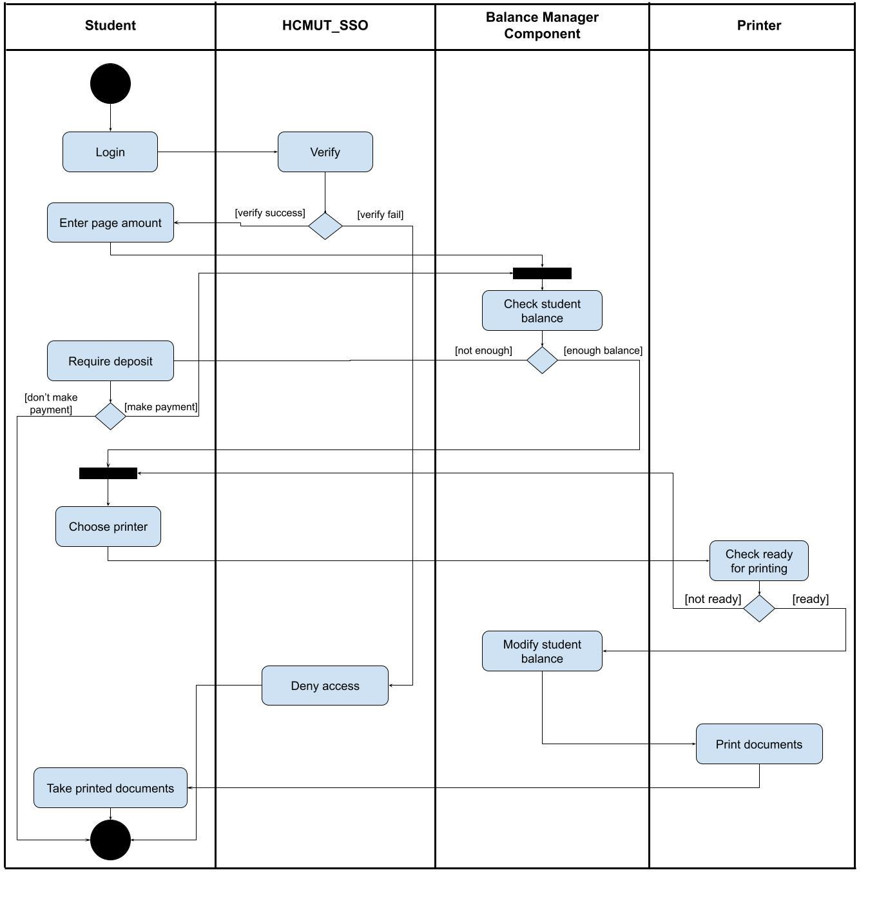
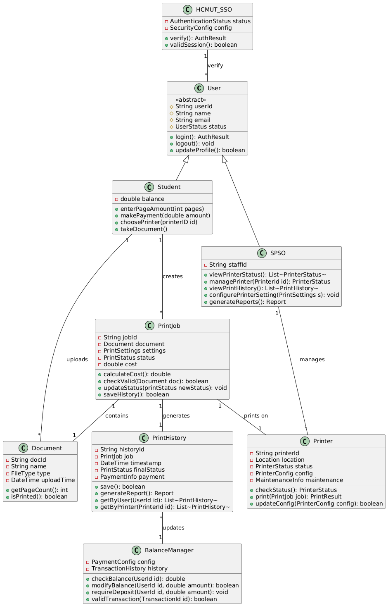

> **A** **smart** **printing** **service** **for** **students** **at**
> **HCMUT** **HCMUT** **SSPS**

||
||
||
||
||
||
||

1\. **Requirements** **elicitation** 1.1. Domain context

> *1.1.1.* *Context*

Hiện nay, nhu cầu sử dụng tài liệu giấy của sinh viên trường Đại học
Bách khoa TP.HCM (HCMUT) càng gia tăng, với nhiều lý do có thể liệt kê
như tiện theo dõi và ghi chú kịp với bài giảng trên lớp, in để đọc và
học đỡ đau mắt, in tài liệu để đi thi… Nhu cầu càng nhiều, kéo theo các
thách thức liên quan đến trải nghiệm dịch vụ in ấn cũng như công tác
quản lý tài liệu. Một hệ thống in ấn thông minh (Student Smart Printing
Service - SSPS) là cần thiết cho các thách thức và nhu cầu đó.

> *1.1.2.* *Stakeholders* *and* *needs*

Sinh viên: việc in ấn thân thiện và tiện lợi, có thể theo dõi và dễ dàng
thay đổi các cài đặt in ấn như in 1 hay 2 mặt, in màu, in bao nhiêu bản
hay bao nhiêu trang…

Student Printing Service Officer - SPSO: truy cập lịch sử in của sinh
viên hay máy in, quản lý các máy in, quản lý số trang in cho sinh viên,
theo dõi tình trạng lịch sử in ấn.

> *1.1.3.* *Stakeholders* *and* *benefit*

Sinh viên: tiết kiệm thời gian và công sức, theo dõi được số trang đã in
và còn lại, xem lại được tài liệu đã in.

SPSO: quản lý hiệu quả, lưu và thống kê lịch sử, theo dõi được các đơn
hàng và các phản hồi để đảm bảo ổn định về chất lượng.

> 1.2. Describe requirements
>
> *1.2.1.* *Functional* *requirements*

Sinh viên:

> \- Đăng nhập và đăng xuất.
>
> \- Cập nhật thông tin tài khoản. - Theo dõi tài liệu và lịch sử in. -
> Mua trang in.
>
> \- Kiểm tra cài đặt in.

SPSO:

> \- Theo dõi thông tin máy in.
>
> \- Theo dõi tài liệu và lịch sử in. - Thêm bớt, vô hiệu máy in.
>
> \- Kiểm tra cài đặt in. - Kiểm tra tệp tin in.
>
> *1.2.2.* *Non-functional* *requirements*
>
> \- Uptime của hệ thống đạt trên 99.5% / năm.
>
> \- Có khả năng phục vụ 300 người dùng đồng thời.
>
> \- Đảm bảo xác thực thông qua hệ thống HCMUT_SSO để có thể truy cập
> vào dịch vụ. - Hỗ trợ sử dụng thông qua 2 nền tảng là website và ứng
> dụng di động.
>
> 1.3. Use-case diagram
>
>  style="width:6.46875in;height:10.07132in" />Use-case diagram toàn hệ
> thống

> Use-case diagram in tài liệu

**Đặc** **tả** **Usecase** **cho** **hệ** **thống:**

> **-** **Verify** **(Log** **in):**

||
||
||
||
||
||
||
||
||
||

> **-** **Buy** **Printing** **Pages:**

||
||
||
||
||
||
||
||
||
||

> **-** **Print** **Document:**

||
||
||
||
||
||
||
||
||
||

> **-** **View** **Print** **History:**

||
||
||
||
||
||
||
||
||
||

> **-** **Manage** **Printer:**

||
||
||
||
||
||
||
||
||
||

> **-** **Change** **System** **Setting:**

||
||
||
||
||
||
||
||
||
||

> **-** **View** **Activity** **Reports:**

||
||
||
||
||
||
||
||
||
||

**Đặc** **tả** **Usecase** **cho** **module:** **●** **Send**
**printing** **request**

||
||
||
||
||
||
||
||
||
||

2\. **System** **Modeling**

> 2.1. Activity Diagram for Student Printing Documents
>
> Activity Diagram của chức năng In tài liệu.

Chức năng in tài liệu yêu cầu sinh viên phải đủ các điều kiện bao gồm :
vượt qua hệ thống xác thực tập trung HCMUT-SSO, số dư đủ để in số trang
tài liệu yêu cầu, máy in được sinh viên chọn phải sẵn sàng để thực hiện
in. Sau khi xác minh đủ các điều kiện để in tài liệu, quá trình in

tài liệu sẽ được thực hiện, hệ thống sẽ trừ số trang in vào số dư tài
khoản của sinh viên, sau đó sinh viên có thể nhận tài liệu tại máy in đã
được chọn in.

> 2.2. Sequence Diagram for Student Printing Document
>
> Sequence Diagram của chức năng In tài liệu.

Chức năng in tài liệu yêu cầu sinh viên được thực hiện theo tuần tự:
vượt qua hệ thống xác thực tập trung HCMUT-SSO, số dư đủ để in số trang
tài liệu yêu cầu. Sau khi xác minh đủ các điều kiện để in tài liệu, quá
trình in tài liệu sẽ được thực hiện, hệ thống sẽ trừ số trang in vào số
dư tài khoản của sinh viên, sau đó sinh viên có thể nhận tài liệu tại
máy in đã được chọn in.

> 2.3. Class Diagram for Student Printing Document

Class diagram cho module in tài liệu, bao gồm các stakeholder và các
class cho kiểm tra đăng nhập, in, kiểm tra thanh toán, lưu lịch sử in và
quản lý máy in.

> 2.4. User Interfaces MVP

Figma Prototype link :

[<u>https://www.figma.com/proto/7PnePyZvObqy0tUC1fyv5h/Software-Engineering-Prototype?nod</u>](https://www.figma.com/proto/7PnePyZvObqy0tUC1fyv5h/Software-Engineering-Prototype?node-id=33625-134&t=keQUpBa2WnAVr6EG-1)
[<u>e-id=33625-134&t=keQUpBa2WnAVr6EG-1</u>](https://www.figma.com/proto/7PnePyZvObqy0tUC1fyv5h/Software-Engineering-Prototype?node-id=33625-134&t=keQUpBa2WnAVr6EG-1)

Đây là trang chủ khi mới truy cập và chưa được đăng nhập. Người dùng là
sinh viên hay nhân viên cần bấm vào nút *Đăng* *nhập* ở góc trên bên
phải để thực hiện đăng nhập xác thực thông qua HCMUT-SSO.

Sau khi đăng nhập, một số thông tin tóm tắt của người dùng sẽ được hiển
thị thay thế vào nút *Đăng* *nhập* khi nảy, để người dùng biết phiên làm
việc hiện tại đã được đăng nhập hay chưa, và đã đăng nhập vào đúng tài
khoản hay chưa.

Trang chủ sẽ được chia làm hai nhóm chức năng cho *Sinh* *viên* và
*Nhân* *viên*. Mỗi vai trò sẽ được quyền truy cập vào những chức năng
đáp ứng cho vai trò đó.

Để thực hiện *In* *tài* *liệu* sinh viên sau khi đăng nhập cần bấm vào
nút chức năng *In* *tài* *liệu* để truy cập vào trang chức năng đó.

Sau khi bấm vào *In* *tài* *liệu*, giao diện chính của chức năng này sẽ
được hiển thị bao gồm một số chức năng nhỏ hơn như: chọn tệp in, chọn
trang in, chọn chế độ in (một hay hai mặt), xem trước tệp in, xem trước
số giấy in cần dùng, xem số giấy in trong số dư của tài khoản.

Sau khi lựa chọn tệp in và cấu hình in phù hợp, sinh viên tiếp tục bằng
cách bấm vào nút *Chọn* *máy* *in*.

Nếu số dư giấy in không đủ so với số giấy in cần dùng để in tài liệu
theo cấu hình in đã chọn, hệ thống sẽ báo lỗi và gợi ý chuyển hướng đến
trang *Mua* *thêm* *trang* *in*. Sinh viên có thể lựa chọn dừng lại
không thực hiện in tài liệu nữa, hoặc di chuyển đến trang *Mua* *thêm*
*trang* *in* để tăng số dư giấy in lên và tiếp tục thực hiện in tài
liệu.

Giao diện trang mua giấy in sẽ cho phép sinh viên nhập số giấy in muốn
mua, sau khi xác nhận, hệ thống sẽ tạo hoá đơn vào BK-Pay, sinh viên cần
thực hiện thanh toán qua BK-Pay. Sau khi hoá đơn ở BK-Pay được hoàn
thành thanh toán, hệ thống sẽ tự động cập nhật số dư giấy in cho sinh
viên.

Khi đã đủ số dư giấy in để thực hiện in theo cấu hình in, sinh viên sẽ
được lựa chọn máy in để thuận tiện cho vị trí nhận tài liệu in. Sinh
viên xem thông tin danh sách máy in có trong hệ thống ở các cơ sở của
nhà trường, xem vị trí của máy in và lựa chọn cho phù hợp với mong muốn
của sinh viên.

Tuy nhiên một máy in không phải lúc nào cũng sẵn sàng cho việc in tài
liệu. Máy in có thể bị hết giấy hoặc đang bị vô hiệu hoá bởi nhân viên
nhằm mục đích bảo trì hay sửa chữa. Nếu máy in mà sinh viên chọn không
sẵn sàng để in tài liệu, hệ thống sẽ thông báo lỗi và yêu cầu sinh viên

chọn lại một máy in khác. Sau khi chọn được máy in phù hợp và sẵn sàng
để in, sinh viên bấm

vào nút *In* *tài* *liệu* để hoàn tất quá trình yêu cầu in tài liệu.

Tất cả các thông tin cần thiết về hoá đơn in tài liệu của sinh viên sẽ
được hiển thị để sinh viên

biết yêu cầu in đã được thực hiện thành công.

3\. **Architecture** **design**

> 3.1. The entire system’s layered architecture design

**User**
**Interface** **layer**

Giao diện người dùng của hệ thống HCMUT-SSPS sẽ được xây dựng dưới dạng
ứng dụng web có hai phân khu chính: dành cho sinh viên và dành cho cán
bộ quản lý. Sinh viên được phép truy cập các chức năng như: in ấn, xem
lịch sử in và thực hiện thanh toán. Giao diện cán bộ quản lý sẽ bao gồm
các chức năng như: quản lý máy in, cấu hình hệ thống, và xem báo cáo
thống kê. Mỗi chức năng sẽ được thiết kế thành một trang riêng biệt để
dễ dàng truy cập. Giao diện sẽ áp

dụng kỹ thuật responsive, nghĩa là tự điều chỉnh để hiển thị tốt trên cả
màn hình máy tính, máy tính bảng và điện thoại. User Interface layer sẽ
được liên kết trực tiếp tới Web Services layer.

> Ảnh minh hoạ giao diện người dùng

**Web** **Services** **layer**

Web Service sẽ được tổ chức thiết kế theo REST API, sử dụng các chức
năng lõi ở lớp bên dưới nó để phục vụ cho yêu cầu API từ lớp User
Interface phía trên. Lớp Web Services sẽ không được phép tương tác trực
tiếp với Database hay các dịch vụ API bên ngoài như BK-Pay và

HCMUT-SSO, nó chỉ được sử dụng các chức năng lõi ở lớp System Core
Utilities ngay bên dưới nó để tương tác gián tiếp tới các thành phần ở
lớp dưới. Điều này giúp nâng cao tính bảo mật và tính tách biệt ở mỗi
lớp, cho phép ta có thể nâng cấp thay đổi hoàn toàn một lớp miễn là nó
tương thích với hai lớp tiếp xúc trực tiếp với nó.

**Data** **Storage**

Hệ thống HCMUT-SSPS sẽ sử dụng cơ sở dữ liệu quan hệ MySQL để lưu trữ
các dữ liệu bao gồm thông tin sinh viên, cán bộ quản lý, dữ liệu máy in,
lịch sử in ấn, các giao dịch thanh toán, … và các dữ liệu khác.

Khối Database Management ở lớp dưới cùng sẽ đảm nhận vai trò tương tác
trực tiếp với cơ sở dữ liệu. Mọi hành động muốn tương tác với cơ sở dữ
liệu từ lớp phía trên đều cần phải thông qua sự quản lý của khối này.

Hệ thống sẽ áp dụng các biện pháp chuẩn hóa dữ liệu để giảm thiểu trùng
lặp, đồng thời có các kế hoạch sao lưu định kỳ để có thể phục hồi dữ
liệu và đảm bảo toàn vẹn dữ liệu trong trường hợp có sự cố xảy ra.

**External** **Services** **/** **APIs**

Hệ thống sẽ tích hợp với các dịch vụ bên ngoài như HCMUT-SSO và BK-Pay
thông qua các API để thực hiện xác thực và thanh toán. Mỗi API này sẽ
được quản lý và kiểm soát thông qua một khối trong lớp dưới cùng. Các
tiếp cận này giúp đảm bảo rằng các dịch vụ bên ngoài được tích hợp an
toàn, dễ dàng quản lý và giảm thiểu rủi ro bảo mật.

> 3.2. Student Printing Documents architecture design
>
> Component Diagram in tài liệu

Sinh viên đăng nhập được SSO xác nhận và gửi yêu cầu in đến SSMS. Hệ
thống xác thực thông tin và kiểm tra số dư tài khoản qua Balance
Manager. Nếu có đủ số dư, yêu cầu in sẽ được thông qua và gửi tới
Printer để in. Cuối cùng, lịch sử in được ghi lại trong Printing History
Manager.

4\. **Implementation** **-** **Sprint** **1**

> 4.1. . 4.2. .

5\. **Implementation** **-** **Sprint** **2** 5.1. .

> 5.2. .
